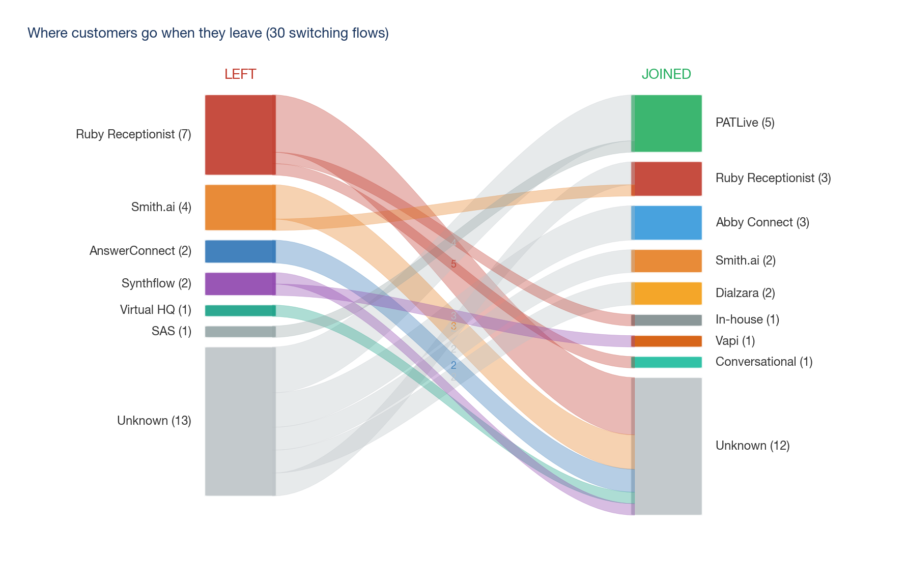

# Why Customers Leave: Virtual Receptionists in the US

I was evaluating whether to enter the virtual receptionist market with an AI product. Before building anything, I needed to understand why customers churn from existing solutions — what pain points aren't being solved, where the gaps are, and what would actually make someone switch.

Feature comparisons and competitor marketing pages don't tell you that. Churning customers do. So I went after churn reviews specifically — the moments where someone is frustrated enough to describe exactly what failed, how much they were paying, and what they did next. That's where the real product insight lives.

I scraped 409 reviews from Reddit and Trustpilot, isolated the 154 that described why someone left, and coded them into a taxonomy of failure modes. The whole thing — scraping, cleaning, classification, dual coding, analysis, charts, and final deliverables — was built and run on my MacBook in under 6 hours using Claude Code.

## The Problem I Was Trying to Solve

The answering service market looks competitive on the surface — dozens of providers, established brands, high ratings. But ratings don't tell you what's broken. I wanted to know: **what are the specific, recurring pain points that existing solutions fail to solve?**

If I could map those pain points systematically, I'd know exactly what to build, what to say in marketing, and whose customers to target first. That meant collecting churn stories at scale and turning them into structured, quantified data I could act on.

## What I Built

### Data Collection
I wrote two Reddit scrapers (live API and Arctic Shift archive) that searched 20 subreddits across SMB verticals — law firms, dental offices, HVAC companies, real estate, MSPs. Queries were split into churn buckets (billing complaints, voice quality issues, call handling failures, switching stories) and blocker buckets (trust concerns, "not ready yet", tried and rejected).

For Trustpilot, I scraped 11 company profiles and specifically went after 1-2 star reviews — that's where the churn signal lives. Ended up with 409 reviews spanning 2015–2026 across 9 competitors: Ruby Receptionist, Smith.ai, AnswerConnect, PATLive, Synthflow, Abby Connect, Dialzara, SAS, and Virtual HQ. The sample is 92% Trustpilot, 8% Reddit.

### Data Cleaning
Raw scraped data is messy. I ran a three-pass pipeline:
1. **Hard filters** — dropped deleted posts, anything under 100 characters, low-engagement Reddit posts (score < 2), and fuzzy duplicates (0.8 similarity threshold)
2. **Relevance check** — must mention an answering service AND contain first-person experience language ("I switched", "we cancelled", "cost us"). Trustpilot reviews skip this since they're already on-topic.
3. **AI classification** — Claude (Sonnet 4.5) read each quote and extracted structured fields: category, competitor, pain point, quality score (1–5), dollar amounts, and whether it's presentation-ready

### Coding the Churn
The 154 churn stories were the core dataset. I wanted categories that would translate directly into product decisions, not academic labels. So I named them in the customer's voice:

| Group | What customers say |
|---|---|
| **Call Handling** | "They don't follow my instructions", "They don't know my business", "They get the details wrong", "Calls go to the wrong place" |
| **Billing** | "Hidden charges on my bill", "I can't cancel", "Surprise charges I can't explain", "It costs too much" |
| **Service Reliability** | "They don't pick up", "It used to be good, then got worse" |
| **Industry Disillusionment** | "I've tried everyone, nobody works" |

To make sure the categorization held up, I ran two independent AI coders against this taxonomy and adjudicated disagreements. Inter-rater reliability came back at **Cohen's kappa = 0.91** — near-perfect agreement. One caveat: both coders are AI, so they may share blind spots that human coders wouldn't.

### Weighting
Not every review is equally useful. A 50-upvote Reddit post with a detailed switching story tells you more than a one-line Trustpilot rant. I weighted quotes by quality score (1–5) × log₂(upvotes) for Reddit, with a flat multiplier for Trustpilot where there's no engagement signal.

### Switching Analysis
30 reviews described switching from one service to another. To figure out direction (did someone *leave* Ruby, or *arrive* at Ruby?), I built a four-step detector: departure phrase matching → arrival phrase matching → sentiment balance → keyword fallback.

### Temporal Analysis
I wanted to check whether Trustpilot ratings actually reflect customer experience. Split the reviews at mid-2024 and found that organic reviews averaged 1.2–3.8 stars. After July 2024, sudden waves of 5-star reviews appeared across multiple companies simultaneously. The service didn't change — the review strategy did.

### Report Generation
Everything downstream — charts, tables, the narrative report — is generated programmatically from the coded data. No hardcoded percentages. If the underlying dataset changes, the whole analysis rebuilds.

The 72% legal vertical finding comes with a caveat I flagged in the report: Reddit churn data skews heavily toward r/LawFirm, so that number partly reflects where the data came from, not just where the market is.

## What I Found


- **76% of churn is call handling (43%) + billing (33%).** These aren't random complaints — they're structural failures baked into the human-pool answering service model. Agents can't follow scripts consistently because they're juggling dozens of clients. Billing is per-minute because that's how the economics work. An AI product solves both by design: AI *is* the script, and flat-rate pricing eliminates the billing model that generates most complaints.

- **Ruby Receptionist is the most vulnerable competitor.** Worst net customer flow of any company in the dataset. Their churners over-index on call handling failures. The go-to-market message for Ruby customers is straightforward: "your calls will be handled right, every time."

- **Smith.ai is vulnerable for a different reason.** Their churn over-indexes on billing — predatory charges, impossible cancellation, opaque pricing. The message for Smith.ai customers is different: "transparent billing, cancel anytime."

- **The ratings are fake.** Organic Trustpilot reviews averaged 1.2–3.8 stars before mid-2024. Then sudden 5-star surges appeared across multiple companies. The service didn't improve — the review strategy changed. This means incumbents are weaker than they look.

- **AI-native competitors (Synthflow) prove the concept but can't execute.** Zero script adherence complaints (AI fixes that by design), but 47% billing churn and 35% reliability churn. They solved the call problem and broke everything else. The window where AI-native entrants have broken platforms is temporary — they're well-funded and will fix execution.

- **72% legal vertical** — lawyers are the natural beachhead market (with the caveat that Reddit data skews toward r/LawFirm).



## Why Use AI for This

This project would normally take a research team several weeks: scraping, reading hundreds of reviews, building a coding taxonomy, training coders, adjudicating disagreements, running analysis, and writing deliverables. I did it as a solo PM.

AI changed what was practical at each step:

- **Classification at scale.** Claude read 409 reviews and extracted structured fields (category, competitor, pain point, dollar amounts, quality score) from unstructured text. Doing this manually for 409 reviews would take days. AI did it in minutes.
- **Dual coding without hiring coders.** The standard for qualitative research is two independent coders + inter-rater reliability. That normally means hiring and training two research assistants. I ran two independent LLM coders and got kappa = 0.91 — the same rigor, without the overhead.
- **Iteration speed.** When I realized the initial 7-category taxonomy wasn't granular enough, I rebuilt it as an 11-category taxonomy and re-coded everything in an afternoon. With human coders, that's a week of retraining and re-coding.
- **End-to-end pipeline.** Scraping, cleaning, classifying, analyzing, charting, and writing the report all flow from code. The analysis is reproducible — change the data, and everything downstream updates.

The product strategy recommendations (what to build, who to target, how to price) are in the [strategy deck](Virtual%20Receptionist%20Churn%20Analysis.pdf) and [deep dive report](Deep%20Dive%20Report.pdf).

## Outputs

| File | Description |
|---|---|
| [`Virtual Receptionist Churn Analysis.pdf`](Virtual%20Receptionist%20Churn%20Analysis.pdf) | **Final deliverable** — 18-slide strategy deck (built with NotebookLM) |
| [`Deep Dive Report.pdf`](Deep%20Dive%20Report.pdf) | Supporting narrative report with charts and recommendations |
| [`churn_quotes_categorized.md`](churn_quotes_categorized.md) | All 154 churn quotes by category |
| [`methodology.md`](methodology.md) | Methodology and data quality notes |

## Repo Structure

```
.
├── Deep Dive Report.docx/.pdf    Narrative report
├── Virtual Receptionist...pdf    Strategy deck
├── churn_quotes_categorized.md   154 quotes by category
├── methodology.md                Research methodology
│
├── analysis/                     15 working analysis memos
├── data/                         Coded data, charts, raw sources
│   ├── charts/                   10 chart PNGs
│   ├── codebook_k9.md            11-category taxonomy
│   ├── coder_a_k9.json           Coder A assignments
│   ├── coder_b_k9.json           Coder B assignments
│   ├── final_quotes.json         409 quotes with metadata
│   └── raw/                      Reddit + Trustpilot source data
└── scripts/                      Scrapers, analysis, report generation
```

## Tools

- **Claude Code** — classification, dual coding, analysis, report writing
- **NotebookLM** (Google) — strategy deck creation
- **Python** — scrapers, data pipeline, chart generation (matplotlib, python-docx)
- **Reddit API / Arctic Shift** + **Trustpilot** — data sources
